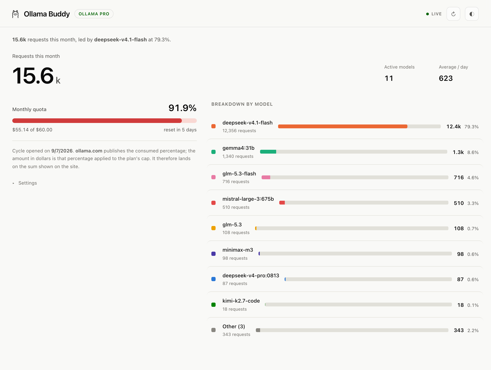

<div align="center">
  
  <h1>Ollama Buddy</h1>
  <p><em>Your Ollama Cloud usage on your Mac — quota, models, live</em></p>

  
  
  
  
  

  [Features](#features) • [Install](#install) • [Usage](#usage) • [The monthly quota](#the-monthly-quota) • [Design](#design) • [Français](README.fr.md)
</div>



---

A macOS app that answers one question: **where has my Ollama Cloud quota got to?**
A Python server with no dependencies reads your usage on `ollama.com` with your key,
a dashboard displays it, and a discreet summary stays in the menu bar at all times.

## Features

- **Exact monthly quota, live** — the percentage published by ollama.com, plus the
  amount in dollars, the burn rate and the reset date.
- **Breakdown by model, across every client** — the terminal, the Ollama app,
  web search and the rest, with the same figures ollama.com shows.
- **A permanent summary in the menu bar** — a coloured dot and the percentage
  (with a key), which opens a compact summary.
- **Real time** — the server pushes changes over SSE, the interface polls nothing.
  On the server side, ollama.com is queried at most once a minute, however many
  tabs are open.
- **In English and French** — the app follows your Mac's language, or you can
  force either one. Both settings are remembered.
- **No dependencies** — Python 3.9+ standard library only. To build the app:
  `swiftc` and Pillow.

## Install

**Requirements** — macOS, and the Xcode command line tools, where `swiftc` comes from:

```bash
xcode-select --install
pip3 install pillow          # to generate the icon
```

```bash
git clone https://github.com/fwBoa/ollama-buddy.git
cd ollama-buddy
./build_app.sh --install     # builds and copies into /Applications
```

Then drag `Ollama Buddy.app` into the Dock. The app starts its server, opens the
dashboard in a native window, exposes the menu bar summary, and stops its server
when you quit. Without `--install`, the bundle stays in the project folder.

The binary is **universal**: Apple Silicon and Intel.

**From the command line** — the same program, without the macOS wrapper:

```bash
python3 ollama_buddy.py            # server + dashboard
```

> [!NOTE]
> Closing the window **does not quit** the app: it lives on in the menu bar.
> `⌘Q` stops the server.

### On someone else's machine

The clean path is **the same command**: clone and build in place. A binary compiled
locally carries no quarantine marker, so macOS asks nothing.

If you would rather ship an already-built `.app` — a GitHub Release, say — the
archive arrives tagged `com.apple.quarantine` and Gatekeeper refuses it: the
signature is **ad-hoc**, with no identified developer. Whoever receives it lifts
that with one command:

```bash
xattr -dr com.apple.quarantine "/Applications/Ollama Buddy.app"
```

Two caveats, stated plainly:

- On macOS 26, an ad-hoc signed `.app` **in quarantine** may report "is damaged and
  can't be opened", sometimes with no button to override it. The command above
  remains the way out.
- A downloaded `.app` needs `/usr/bin/python3`, which itself requires the Xcode
  tools. Without them, the app opens and then fails. Building from source has no
  such problem, since `swiftc` already demands them.

Avoiding all that would mean a *Developer ID* signature and Apple notarisation,
hence the Apple Developer Program at $99/year. Without it, **building from source
is the only frictionless path** — and the one to recommend.

> [!NOTE]
> Homebrew is no longer a way out either: since 1 September 2026, casks that fail
> the Gatekeeper check are no longer accepted into the official repositories.

## Usage

| Shortcut | Action |
|---|---|
| `⌘1` | Show the window |
| `⌘R` | Reload the dashboard |
| `⌘⇧R` | Ask ollama.com for usage again |
| `⌘O` | Open in the browser |
| `⌘Q` | Quit (stops the server) |

The dashboard carries three buttons in its top right. The first asks ollama.com for
usage again — without it, the one-minute cache would serve the same value. The second
cycles the three themes: **automatic** (follows macOS), **light**, **dark**. The third
cycles the language: **automatic** (follows the system language), **English**,
**French**. Both settings are remembered, and both appear again as a list in
*Settings*.

The menu bar summary and the macOS menus follow the same setting — no second place to
configure.

### The menu bar

A coloured dot, then the percentage consumed **when an API key is stored** — blue,
orange at 70%, red at 90%. With no key, the icon shows only a llama followed by a
dash: no figure is published.

A click opens a summary: quota, reset date, this month's consumption and the top
three models — with a key. Without one, it settles for the invitation to enter a
key, and a button to the dashboard.

The summary is live too: it updates for as long as it stays open.

## The monthly quota

Ollama includes **$60 of usage per month on Pro**, and **$300 on Max**. That is the
measure that matters, because it covers **all** your clients, including those whose
requests the app never sees.

The app reads your plan from the local Ollama app and takes its cap from there. The
**Monthly cap** setting overrides that — leave the field empty to follow the plan
again. A plan the app doesn't know shows no dollar amount rather than a wrong one.

### Linking your account (BYOK)

The app works with **your own key**: create one at
[ollama.com/settings/keys](https://ollama.com/settings/keys), paste it into the
dashboard, and your usage is read live.

What the key unlocks:

| | |
|---|---|
| The month's percentage | `limits.monthly.usage`, exact and refreshed on its own |
| Requests per model | `limits.monthly.models`, **across every client** |
| The rate in $/day | measured from samples taken every five minutes, once a full day has accumulated |

What it does not give you, and how the app copes:

| | |
|---|---|
| The amount in dollars | The API returns only a **share** (`0.874`), not a sum. The app multiplies it by the plan's cap, which lands back on the figure the site displays. |
| The reset date | ollama.com does not publish it — `activity.period` is a rolling four-week window, not a billing cycle. So the app measures it: usage falling back to zero is a reset, and that day number then replays monthly, like the subscription. Once two resets have been seen, they say which of the two it is: the same day number twice means a calendar month, and the app keeps replaying the day; a day number that has moved means a fixed interval, and it replays that many days instead. The **Next reset** setting carries the first cycle, before anything has been observed; after that the measurement wins, because a date typed into a field is confirmed by nothing. Until it has one of the two, it says so instead of inventing a date. |

> [!WARNING]
> `ollama.com/api/usage` is **not documented**. If the route disappears or the key is
> refused, the app shows **no quota figure at all**: it invites you to enter one. That
> is deliberate: the quota is ollama.com's data, and without a key there is none. The
> reset date, though, still works: it comes from your settings or from a reset the app
> observed earlier, neither of which depends on reading today's usage.

The key lives in `config.json`, at `0600`, and is never sent back to the browser —
the input field stays empty even when a key is stored. It serves only to **read**
your usage.

To **replace or remove it**: *Settings*, below the quota.

### Without a key

The app **shows nothing at all** — no percentage, no meter, no amount, no countdown,
no breakdown. The page reduces to the sign-in card.

That is deliberate. The quota is ollama.com's data: without a key, the app has none,
and it would rather say so than display an approximation. The reset date stays
editable in the settings — it comes from there or from a reset the app observed
earlier, never from the API — but it is not displayed: it is not a measurement, only
a setting.

## Where the figures come from

A single source: `ollama.com/api/usage`, with your key. It covers **all** your
clients, including those whose requests the app never sees.

`web search` and `web fetch` appear as models — that is how Ollama counts them.
Beyond eight models, the rest is grouped under "Other".

## Design

**Layout.** Fluid rather than fixed: maximum width 1560px, gutters and heading sizes
in `clamp()`, two columns that fold into one below 940px. Components use **container
queries** — the model list reacts to *its* width, not the window's.

**Colours.** Eight categorical hues — those of the validation tool's reference
palette — plus a grey for "Other", which is not a series but a remainder. The
validator confirms, in both themes: lightness band, chroma floor, and separation for
colour vision deficiencies (ΔE ≥ 8 in OKLab). In the dark theme, all eight also clear
the 3:1 contrast threshold; **in the light theme, three of them — aqua, yellow,
magenta — stay below it**, and that is documented as such. The remedy is not colour:
each model carries its name, its request count and its percentage **written beside
it**. Information is never carried by hue alone. Each model keeps its own
**permanently** (stored in the database), never according to its rank.

**Theme.** Light and dark are two **chosen** palettes, not an automatic inversion.
The theme follows macOS by default, and can be forced.

**The llama.** `web/ollama.png` serves as a **CSS mask** in the header — so it takes
the text colour and follows both themes without needing two files — and as a
**template image** in the menu bar, where macOS inverts it according to the
background.

**Motion.** Custom easing curves, transitions under 300ms, `scale(0.97)` on click,
staggered entrance. Hover states are gated behind `@media (hover: hover)`.
`prefers-reduced-motion` is respected: fades remain, movement disappears.

**Accessibility.** Skip link, focus visible for keyboard only, programmatic labels,
an `aria-live` region, targets ≥ 24px, and **no information carried by colour alone**:
the quota meter changes hue, but the percentage is written beside it.

## Files

| File | Role |
|---|---|
| `ollama_buddy.py` | HTTP server, reading ollama.com usage, SSE stream |
| `web/index.html` | The dashboard |
| `web/mini.html` | The menu bar summary |
| `app/main.swift` | The macOS wrapper: window, menu bar, lifecycle |
| `app/make_icon.py` | Generates `AppIcon.icns` (Pillow + `iconutil`) |
| `build_app.sh` | Assembles the bundle, `--install` to copy it into /Applications |
| `config.example.json` | The shape of the configuration file |
| `config.json` | Your configuration. **Not versioned** |
| `usage.db` | Local SQLite index. Deletable, it rebuilds itself |

The macOS app stores its data in `~/Library/Application Support/OllamaBuddy/`.

## Notes

- The server listens only on `127.0.0.1`.
- Only `127.0.0.1:11434` (Ollama, for the plan name) and `ollama.com` (with a key)
  are queried. Nothing the app measures leaves the machine: only the key and the
  usage request go to ollama.com.
- **`11435` is already taken by the Ollama app** — hence the default port `11499`.
