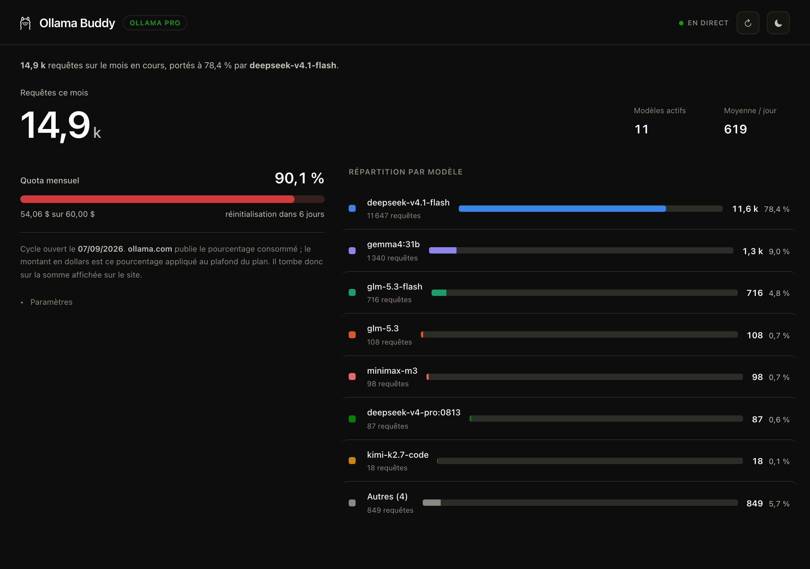

<div align="center">
  
  <h1>Ollama Buddy</h1>
  <p><em>Ta consommation Ollama Cloud sur ton Mac — quota, modèles, en temps réel</em></p>

  
  
  
  
  

  [Fonctionnalités](#fonctionnalités) • [Installation](#installation) • [Utilisation](#utilisation) • [Le quota](#le-quota-mensuel) • [Conception](#conception)
</div>



---

Une app macOS qui répond à une seule question : **où en est mon quota Ollama Cloud ?**
Un serveur Python sans dépendance lit l'usage sur `ollama.com` avec ta clé, un tableau
de bord l'affiche, et un aperçu discret reste en permanence dans la barre de menus.

## Fonctionnalités

- **Quota mensuel exact, en direct** — le pourcentage publié par ollama.com, plus le
  montant en dollars, le rythme de dépense et la date de réinitialisation.
- **Répartition par modèle, tous clients confondus** — Claude Code, l'app Ollama, la
  recherche web et le reste, avec les mêmes chiffres qu'ollama.com.
- **Aperçu permanent dans la barre de menus** — un point de couleur et le pourcentage
  (avec une clé), qui ouvre un résumé compact.
- **Temps réel** — le serveur pousse les changements en SSE, l'interface n'interroge
  rien périodiquement. Côté serveur, ollama.com est sollicité au plus une fois par
  minute, quel que soit le nombre d'onglets ouverts.
- **Aucune dépendance** — bibliothèque standard de Python 3.9+. Pour construire
  l'app : `swiftc` et Pillow.

## Installation

**Prérequis** — macOS, et les outils en ligne de commande Xcode, d'où vient `swiftc` :

```bash
xcode-select --install
pip3 install pillow          # pour générer l'icône
```

```bash
git clone https://github.com/<ton-compte>/ollama-buddy.git
cd ollama-buddy
./build_app.sh --install     # construit et copie dans /Applications
```

Puis glisse `Ollama Buddy.app` dans le Dock. L'app démarre son serveur, ouvre le
tableau de bord dans une fenêtre native, expose l'aperçu de la barre de menus, et
arrête son serveur quand tu quittes. Sans `--install`, le bundle reste dans le
dossier du projet.

Le binaire est **universel** : Apple Silicon et Intel.

**En ligne de commande** — le même programme, sans l'enveloppe macOS :

```bash
python3 ollama_buddy.py            # serveur + tableau de bord
```

> [!NOTE]
> Fermer la fenêtre **ne quitte pas** l'app : elle continue de vivre dans la barre de
> menus. `⌘Q` arrête le serveur.

### Chez quelqu'un d'autre

Le chemin propre est **la même commande** : clone et build sur place. Un binaire
compilé localement ne porte pas le marqueur de quarantaine, donc macOS ne demande
rien.

Si tu joins plutôt un `.app` déjà construit — une Release GitHub, par exemple —
l'archive arrive marquée `com.apple.quarantine` et Gatekeeper la refuse : la
signature est **ad-hoc**, sans développeur identifié. La personne qui la reçoit
lève ça en une commande :

```bash
xattr -dr com.apple.quarantine "/Applications/Ollama Buddy.app"
```

Deux réserves, dites franchement :

- Sur macOS 26, un `.app` signé ad-hoc **et** en quarantaine peut afficher « est
  endommagé et ne peut pas être ouvert », parfois sans bouton pour passer outre.
  La commande ci-dessus reste la sortie.
- Un `.app` téléchargé a besoin de `/usr/bin/python3`, qui réclame lui aussi les
  outils Xcode. Sans eux, l'app s'ouvre puis échoue. Le build depuis les sources
  n'a pas ce problème, puisque `swiftc` les exige déjà.

Éviter tout ça demanderait une signature *Developer ID* et une notarisation Apple,
donc l'Apple Developer Program à 99 $/an. Sans lui, **le build depuis les sources
est le seul chemin sans friction** — et c'est celui à recommander.

> [!NOTE]
> Homebrew n'est plus une porte de sortie : depuis le 1er septembre 2026, les casks
> qui échouent au contrôle Gatekeeper ne sont plus acceptés dans les dépôts
> officiels.

## Utilisation

| Raccourci | Action |
|---|---|
| `⌘1` | Afficher la fenêtre |
| `⌘R` | Recharger le tableau de bord |
| `⌘⇧R` | Redemander l'usage à ollama.com |
| `⌘O` | Ouvrir dans le navigateur |
| `⌘Q` | Quitter (arrête le serveur) |

Dans le tableau de bord, le bouton en haut à droite fait défiler les trois thèmes :
**automatique** (suit macOS), **clair**, **sombre**. Le réglage est conservé. Celui
d'à côté redemande l'usage à ollama.com — sans lui, le cache d'une minute servirait la
même valeur.

### La barre de menus

Un point de couleur, puis le pourcentage consommé **quand une clé API est
enregistrée** — bleu, orange à 70 %, rouge à 90 %. Sans clé, l'icône n'affiche
qu'un lama suivi d'un tiret : aucun chiffre n'est publié.

Un clic ouvre un résumé : quota, date de réinitialisation, consommation du mois et
trois principaux modèles — avec une clé. Sans clé, il se contente de l'invitation à en
saisir une, et d'un bouton vers le tableau de bord.

L'aperçu est lui aussi en direct : il se met à jour tant qu'il reste ouvert.

## Le quota mensuel

Ollama Pro inclut **60 $ d'usage par mois**. C'est la mesure qui compte, parce qu'elle
couvre **tous** tes clients, y compris ceux dont l'app ne voit jamais passer la requête.

### Relier ton compte (BYOK)

L'app fonctionne avec **ta propre clé** : crée-la sur
[ollama.com/settings/keys](https://ollama.com/settings/keys), colle-la dans le tableau
de bord, et l'usage se lit en direct.

Ce que la clé débloque :

| | |
|---|---|
| Le pourcentage du mois | `limits.monthly.usage`, exact et rafraîchi tout seul |
| Les requêtes par modèle | `limits.monthly.models`, **tous clients confondus** |
| Le rythme en $/jour | mesuré sur des échantillons pris toutes les cinq minutes, une fois une journée pleine accumulée |

Ce qu'elle ne donne pas, et comment l'app s'en sort :

| | |
|---|---|
| Le montant en dollars | L'API ne renvoie qu'une **part** (`0,874`), pas une somme. L'app la multiplie par le plafond du plan, ce qui retombe sur la somme affichée par le site. |
| La date de réinitialisation | Déduite du cycle en cours : `activity.period.starting_at` donne le début de l'abonnement, le mois se rejoue au même quantième. Cycle ouvert le 07/09 → remise à zéro le 07/10. |

> [!WARNING]
> `ollama.com/api/usage` n'est **pas documenté**. Si la route disparaît ou si la clé
> est refusée, l'app n'affiche **plus aucun chiffre de quota** : elle invite à en
> saisir une. C'est délibéré : le quota est une donnée d'ollama.com, et sans clé il n'y
> en a aucune. La date de réinitialisation reste modifiable dans les réglages, où elle
> sert de repli à l'API.

La clé vit dans `config.json`, en `0600`, et n'est jamais renvoyée au navigateur — le
champ de saisie reste vide même quand une clé est enregistrée. Elle ne sert qu'à
**lire** ton usage.

Pour la **remplacer ou la retirer** : *Paramètres*, sous le quota.

### Sans clé

L'app **ne montre rien du tout** — ni pourcentage, ni jauge, ni montant, ni compte à
rebours, ni répartition. La page se réduit à la carte de connexion.

C'est délibéré. Le quota est une donnée d'ollama.com : sans clé, l'app n'en a aucune,
et elle préfère le dire plutôt que d'afficher un à-peu-près. La date de réinitialisation
reste modifiable dans les réglages — elle y sert de repli à l'API — mais elle ne
s'affiche pas : ce n'est pas une mesure, juste un paramètre.

## D'où viennent les chiffres

Une seule source : `ollama.com/api/usage`, avec ta clé. Elle couvre **tous** tes
clients, y compris ceux dont l'app ne voit jamais passer la requête.

`web search` et `web fetch` apparaissent comme des modèles — Ollama les compte ainsi.
Au-delà de huit modèles, le reste est regroupé sous « Autres ».

## Conception

**Mise en page.** Fluide plutôt que figée : largeur maximale 1560 px, gouttières et
tailles de titre en `clamp()`, deux colonnes qui se replient en une seule sous 940 px.
Les composants utilisent des **container queries** — la liste des modèles réagit à *sa*
largeur, pas à celle de la fenêtre.

**Couleurs.** Palette catégorielle validée par calcul, dans les deux thèmes, sur la
surface réelle : bande de clarté, plancher de chroma, séparation pour les daltonismes
(ΔE ≥ 8 en OKLab) et contraste ≥ 3:1. Chaque modèle garde sa teinte de façon
**permanente** (stockée en base), jamais selon son rang.

**Thème.** Clair et sombre sont deux palettes **choisies**, pas une inversion
automatique. Le thème suit macOS par défaut, et peut être forcé.

**Le lama.** `web/ollama.png` sert de **masque CSS** dans l'en-tête — il prend donc la
couleur du texte et suit les deux thèmes sans qu'il faille deux fichiers — et d'**image
gabarit** dans la barre de menus, où macOS l'inverse selon le fond.

**Mouvement.** Courbes d'easing personnalisées, transitions sous 300 ms, `scale(0.97)`
au clic, apparition en cascade. Les survols sont conditionnés à `@media (hover: hover)`.
`prefers-reduced-motion` est respecté : les fondus restent, les déplacements disparaissent.

**Accessibilité.** Lien d'évitement, focus visible au clavier uniquement, libellés
programmatiques, région `aria-live`, cibles ≥ 24 px, et **aucune information portée par
la seule couleur** : la jauge du quota change de teinte, mais le pourcentage est écrit
à côté.

## Fichiers

| Fichier | Rôle |
|---|---|
| `ollama_buddy.py` | Serveur HTTP, lecture de l'usage ollama.com, flux SSE |
| `web/index.html` | Le tableau de bord |
| `web/mini.html` | L'aperçu de la barre de menus |
| `app/main.swift` | L'enveloppe macOS : fenêtre, barre de menus, cycle de vie |
| `app/make_icon.py` | Génère `AppIcon.icns` (Pillow + `iconutil`) |
| `build_app.sh` | Assemble le bundle, `--install` pour le copier dans /Applications |
| `config.example.json` | Forme du fichier de configuration |
| `config.json` | Ta configuration. **Non versionné** |
| `usage.db` | Index SQLite local. Supprimable, il se reconstruit |

L'app macOS stocke ses données dans `~/Library/Application Support/OllamaBuddy/`.

## Notes

- Le serveur écoute uniquement sur `127.0.0.1`.
- Seuls `127.0.0.1:11434` (Ollama, pour le nom du plan) et `ollama.com` (avec une clé)
  sont interrogés. Rien de ce que l'app mesure ne quitte la machine : seuls la clé et
  la requête d'usage partent vers ollama.com.
- **`11435` est déjà pris par l'app Ollama** — d'où le port `11499` par défaut.
